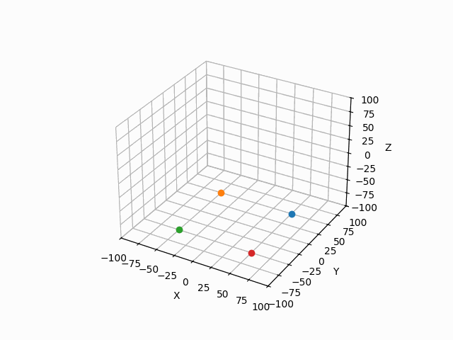
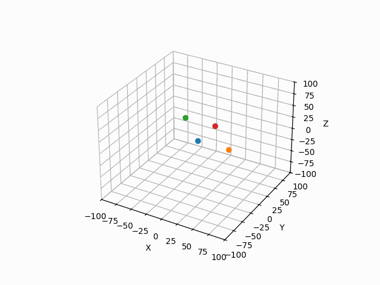
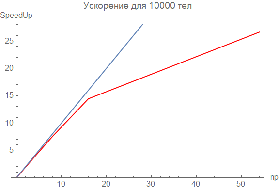
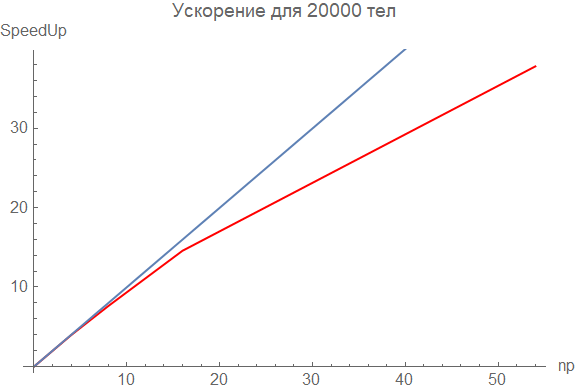
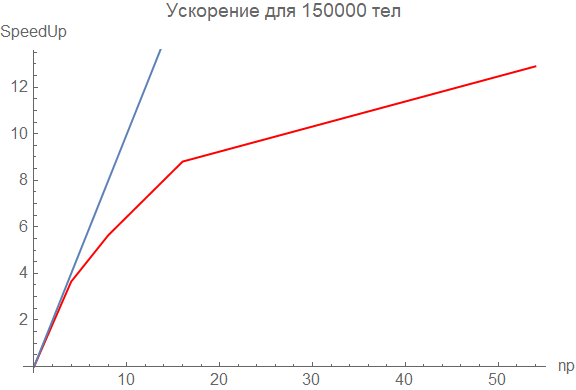

[//]: # (<p align="center">)

[//]: # (      )

[//]: # (</p>)

# 🥎 Моделирование движения N тел с использованием MPI

 

## 🏀 Описание задания

Задача заключается в моделировании движения $N$ тел, взаимодействующих через гравитационное притяжение. Каждый объект системы моделируется как материальная точка с известными начальными положениями и скоростями, а также массой.

Движение тел описывается системой дифференциальных уравнений Ньютона:

```math
\dfrac{d \overline{r}_i}{d t} = \overline{\upsilon}_i,
```
```math
    \dfrac{\overline{\upsilon}_i}{d t} = \overline{a}_i,
```

где $\overline{r}_i$ — положение тела в пространстве, $\overline{\upsilon}_i$ — скорость тела, а $\overline{a}_i$ — его ускорение, которое вычисляется через гравитационное взаимодействие с другими телами:

```math
\overline{a}_i = - \sum\limits_{\substack{j = 1 \\ j \ne i}}^N \dfrac{G \, m_j \, (\overline{r}_i - \overline{r}_j)}{|\overline{r}_i - \overline{r}_j|^3}
```

Задача решается с использованием численных методов, таких как метод Рунге-Кутты, для приближенного вычисления положения и скорости тел в дискретные моменты времени. Решение задачи при этом осуществляется с использованием параллельных вычислений с применением MPI (Message Passing Interface).

## ⚽️ Описание методов

Для решения задачи использовался метод Рунге-Кутты $4$-го порядка точности. Этот метод позволяет с высокой точностью решать систему обыкновенных дифференциальных уравнений, позволяя моделировать движение тел на каждом временном шаге.

Система уравнений решается пошагово с использованием малых шагов по времени $\tau$, с увеличением точности по мере уменьшения величины шага. Для ускорения вычислений и выполнения модели на больших значениях $N$ (количество тел) была реализована параллельная версия программы, использующая MPI. Это позволяет значительно ускорить процесс расчетов, распределяя вычисления по нескольким процессам, что особенно важно при моделировании систем с большим числом тел.

**Особенности реализации:**
1. **Метод Рунге-Кутты** — используется для численного решения дифференциальных уравнений с заданной точностью.
2. **MPI** — позволяет эффективно распределять вычисления по нескольким процессам, что значительно ускоряет процесс симуляции при увеличении числа тел в системе.
3. **Оптимизация** — благодаря использованию MPI, вычисления ускоряются, что позволяет моделировать системы с сотнями и тысячами тел.

## 🏉 Результаты реализации

В результате реализации был получен рабочий алгоритм для моделирования движения тел в гравитационном поле, который учитывает взаимодействие всех тел друг с другом. Программа способна вычислять траектории движения тел и отображать их в виде анимаций.

### 🎾  Анимации тел

Для наглядности были созданы анимации, которые показывают движение тел в пространстве на разных этапах симуляции. Визуализация была реализована с помощью графических библиотек, что позволяет наблюдать за изменением положения тел во времени. Пример анимаций можно найти выше.


### 🏈 Сравнительные результаты производительности

Была проведена серия тестов с различным количеством потоков для сравнения производительности программы. В результате тестов был сделан вывод о том, как масштабирование количества потоков влияет на время выполнения симуляции при увеличении числа тел в системе.

# Результаты сравнения производительности

| N (количество тел) | Последовательно (время) | 4 (время) | SpeedUp (на 4 процессах) | 8 (время) | SpeedUp (на 8 процессах) | 16 (время) | SpeedUp (на 16 процессах) | 54 (время) | SpeedUp (на 54 процессах) |
|--------------------|--------------------------|-----------|--------------------------|-----------|--------------------------|------------|----------------------------|------------|----------------------------|
| 10000              | 0.703995                 | 0.185422  | 3.796717757              | 0.0934349 | 7.534604307              | 0.0487653  | 14.43639227                | 0.0264421  | 26.62402003                |
| 15000              | 1.58242                  | 0.423069  | 3.740335501              | 0.218326  | 7.247968634              | 0.111219   | 14.22796465                | 0.0424128  | 37.30996303                |
| 20000              | 2.84818                  | 0.718926  | 3.961715114              | 0.373832  | 7.618876929              | 0.195224   | 14.5892923                 | 0.0753192  | 37.81479357                |
| 35000              | 8.58704                  | 2.18372   | 3.932299013              | 1.12623   | 7.624588228              | 0.585118   | 14.67574062                | 0.409677   | 20.96051279                |
| 50000              | 17.5148                  | 4.44674   | 3.938795612              | 2.30079   | 7.612515701              | 1.21019    | 14.47276874                | 0.763507   | 22.93993375                |
| 100000             | 69.9983                  | 17.9353   | 3.902822925              | 9.95545   | 7.03115379               | 7.17951    | 9.749732224                | 4.92034    | 14.22631363                |
| 150000             | 157.414                  | 43.1081   | 3.651610718              | 27.8758   | 5.646976948              | 17.8682    | 8.809729016                | 12.201     | 12.90172937                |
| 200000             | 281.184                  | 88.8771   | 3.163739591              | 57.4551   | 4.89397808               | 32.1883    | 8.735596474                | 22.6376    | 12.42110471                |

  

здесь и далее `np` -- количество потоков

## 🏐 Заключение

Моделирование движения $N$ тел с использованием метода Рунге-Кутты и MPI показало высокую эффективность для вычислений с большим количеством тел. Применение параллельных вычислений значительно ускоряет процесс моделирования, что открывает возможности для более сложных и масштабных исследований.

## 🧶 Установка и запуск

1. Склонируйте репозиторий:

   ```bash
   git clone https://github.com/your-username/gravity-simulation.git
   ```

2. Перейдите в директорию проекта:

   ```bash
   cd gravity-simulation
   ```

3. Скомпилируйте программу:

   ```bash
   make
   ```

4. Запустите программу:

   ```bash
   mpirun -np 4 ./gravity_simulation
   ```

   Где `-np 4` указывает на количество процессов.
